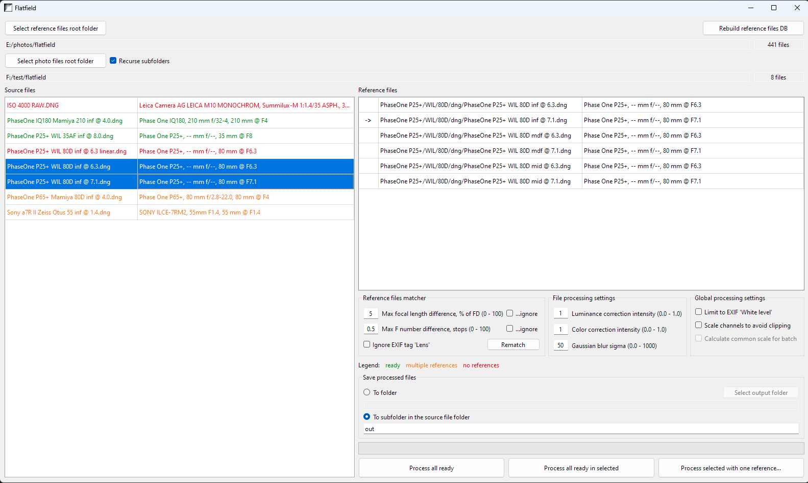
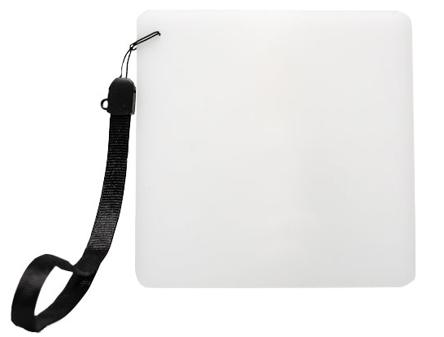
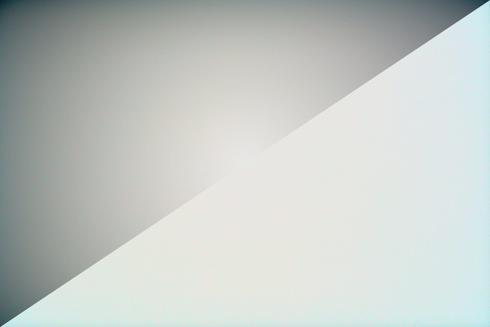
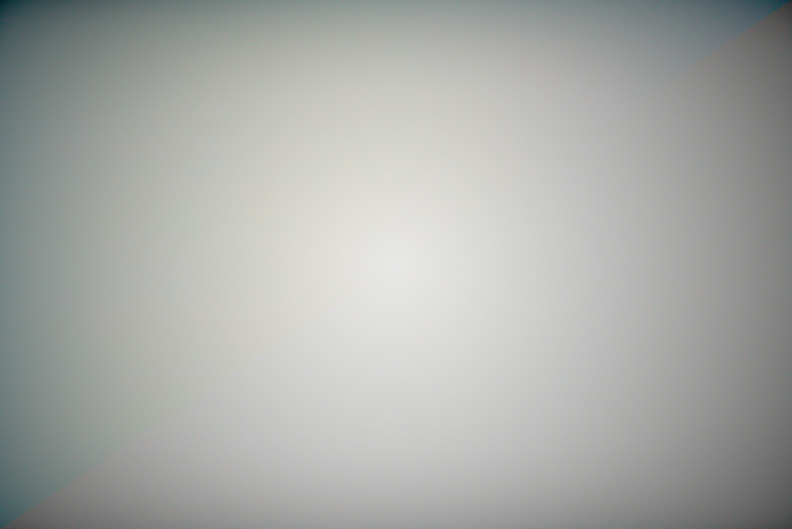
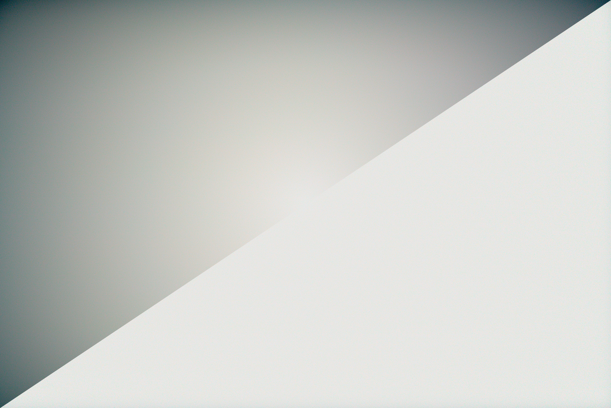

# Flatfield

A simple Windows app for correcting optical vignetting and color shifts caused by lens and IR/AA filter stack.
It is written in c++ with Qt, and includes https://github.com/opencv/opencv and https://github.com/exiv2/exiv2

This application was inspired by following facts:
- the only application I know that can correct various casts in raw image **and write corrected image to raw DNG** is Adobe Lightroom. Also, there is an application called CornerFix, but it's approach to correction is not suitable in most cases
- UX of Lightroom flat field correction is ugly and annoying
- Lightroom costs money even if the flat field (FF) correction is the only feature you need
- (the most important one) Lightroom's FF correction feature has a long-lasting bug, that Adobe ignores or refuses to fix: https://community.adobe.com/t5/lightroom-classic-discussions/flatfield-correction-behavior/m-p/12948584#M274777

Credits go to DPReview forum member Horshack https://www.dpreview.com/forums/thread/4566327

There is a console python application which does the same: https://github.com/OleksiiMatiash/pyffy/

## Features:
- separate control of the correction intensity for luminance and color casts
- automatic search for appropriate reference file in the given FF files folder
- adjustable radius of gaussian blur used to exclude dust from correction
- can write corrected files to the output folder or overwrite source files
- supports bayer, linear (demosaiced) and monochrome files
- limit values in the processed file to the 'White level' tag values in Exif, or allow it to use full 16 bit range.
- scale the result instead of clipping to fit it to camera range set in 'White level' tag in Exif, or to the full 16 bit range
- calculate common scale for batch to avoid exposure 'jumps' in panorama shots, for example
- various source-to-reference file matching options
- files can be processed with one reference file even if it is not in the database and\or is considered incompatible by reference matcher. The only limitation is data compatibility: the same camera and same DNG creation tool.

### Limitations
- only non-compressed DNG is supported
- multi image (pixel shift, for example) DNG is not supported
- automatic match based on focusing distance (not focal length!) is impossible. So if some lens vignetting differs significantly when focused to infinity and MDF, two or three reference files should be taken and selected manually from the list.
- image dngs and reference dngs should be produced by one application. While dngs produced by different apps **may** be compatible, most probably they would not.

## How to use
First of all, this application requires reference file(s), i.e. **uniform** shots taken with the same camera, lens, and more or less (more about it later) the same focal length and aperture. Uniformity can be most easily achieved by shooting clear sky without the sun in the frame though a uniform white plastic like this:

Detailed process of creation reference files can be found in the Internet, but basic recommendations are:

- shot should be fully uniform, so all brightness and color variations come from lens and filter
- there should be shots for all used apertures, but small difference (i.e. correction of shot taken with aperture f/3.2 by reference taken with f/2.8) are acceptable
- there should be 2-3 shots for each aperture:

   - shot at infinity
   - at minimum focusing distance
   - at the middle between infinity and MFD

### Reference files database preparation
When the reference files are created, click "Select reference files folder" and point it to the root of the folder containing reference files. The application will scan it for supported files and create a database to avoid rescanning on each application launch. Total number of found reference files will be shown below the button "Rebuild reference files DB".
If files were added\removed from the reference files tree, the database must be rebuilt, it can be achieved by clicking "Rebuild reference files DB" button.

### Reference selection
Click "Select photo files root folder". Application will scan this folder, and subfolders if "Recurse subfolders" checkbox is set, for supported files, and fill source files list.
Files are colored by following rule:

- red, if there are no compatible reference file
- orange, if there are more than one compatible reference files
- green, if there is exactly one compatible reference file.

Green files are ready to be processed with default correction options (more on that below), orange should be went over selecting reference file from compatible files list.
Multiple source files selection is supported, but reference files will be shown only in case when selected source files can have common reference file, i.e. shot with the same camera, and fitting in the reference matcher options.

### Correction parameters
When one or more files are selected, fields in the 'File processing options' are enabled, and can be edited. In most cases default values should be left untouched, but for special cases it can be corrected. Luminance and color correction intensity is self-explanatory, but Gaussian blur sigma requires explanation. Before the reference file is applied to the source, the reference file is blurred to remove noise and dust. Intensity of blur is controlled by gaussian blur sigma. Lower values will lead to lower blur and faster processing, and vice versa. Default radius is 50.

### Correction with references from database
When one or more files are ready, i.e. with only one available reference, or with reference selected from compatiable, it can be processed using buttons 'Process all ready' or 'Process all ready in selected'

### Correction with reference not from database
Button 'Process selected with one reference...' opens file choosing dialog, and then selected files are processed with chosen reference, if they are compatible by data: the same camera, and same DNG creation tool.

## Examples
File is shot on Sony a7R II, contrast and saturation are boosted to demonstrate correction.

Original / full luminance correction, no color correction:

Original / no luminance correction, full color correction:

Original / full luminance correction, full color correction:

## Disclaimer

Application is provided as is without any guarantees. I am not and will not be responsible for any damage to your files it can make.